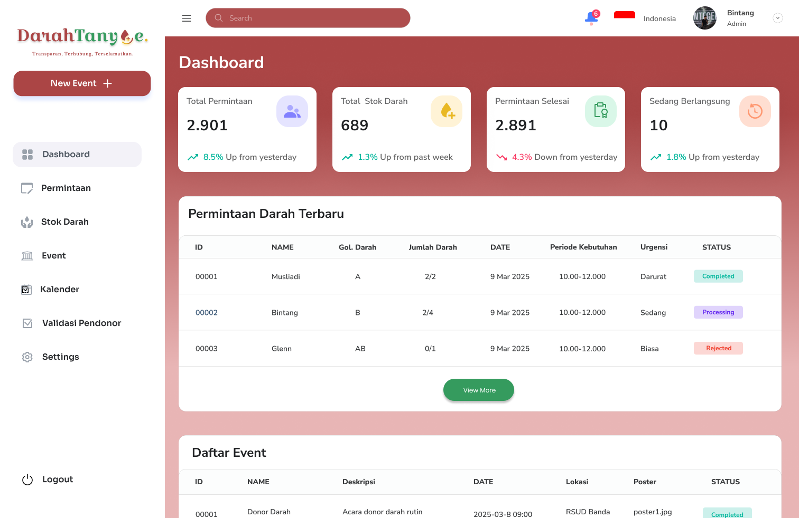

# DarahTanyoe: Ekosistem Cerdas untuk Donor Darah yang Transparan dan Real-Time

<p align="center"><a href="https://github.com/MuhammadBintang27/DarahTanyoe_App" target="_blank"></a></p>

## Deskripsi
DarahTanyoe adalah platform inovatif berbasis mobile dan web yang menghubungkan Resipien , Pendonor, dan Intuisi Medis dalam satu ekosistem digital. Dengan fitur real-time monitoring stok darah dan pencocokan otomatis antara pemohon dan pendonor, aplikasi ini bertujuan untuk meningkatkan transparansi dan efisiensi dalam sistem donor darah.

Aplikasi ini didesain untuk menjawab tantangan distribusi darah yang selama ini tidak optimal, sering kali mengandalkan pencarian manual melalui media sosial atau grup WhatsApp. Dengan teknologi yang mendukung pencocokan otomatis dan notifikasi berbasis tingkat urgensi, DarahTanyoe memastikan bahwa donor dan penerima darah dapat terhubung lebih cepat dan akurat.

## Minimum Viable Product (MVP)
- **Integrasi Permintaan Terdekat**: Sistem akan secara otomatis mendeteksi dan menampilkan permintaan donor darah yang paling dekat dengan lokasi pengguna.
- **Broadcast Permintaan ke WhatsApp**: Permintaan donor darah dapat langsung dikirim ke WhatsApp pendonor terdekat untuk respons yang lebih cepat.
- **Transparansi Stok Darah**: Informasi stok darah di rumah sakit dan PMI terdekat diperbarui secara real-time untuk memastikan ketersediaan yang jelas bagi semua pengguna.

## Tampilan Mobile

<table align="center">
  <tr>
    <td align="center"></td>
    <td align="center"></td>
  </tr>
  <tr>
    <td align="center">🔥 Hero</td>
    <td align="center">📝 Register</td>
  </tr>
  <tr>
    <td align="center"></td>
    <td align="center"></td>
  </tr>
  <tr>
    <td align="center">🏠 Home</td>
    <td align="center">🔔 Notifikasi</td>
  </tr>
  <tr>
    <td align="center"></td>
    <td align="center"></td>
  </tr>
  <tr>
    <td align="center">🩸 Permintaan Darah</td>
    <td align="center">✅ Pendaftaran Donor</td>
  </tr>
</table>

## Tampilan Web

<table align="center">
  <tr>
    <td align="center"></td>
    <td align="center"></td>
  </tr>
  <tr>
    <td align="center">📊 Dashboard</td>
    <td align="center">🩸 Pop Up Permintaan Darah</td>
  </tr>
  <tr>
    <td align="center"></td>
    <td align="center"></td>
  </tr>
  <tr>
    <td align="center">📦 Pop Up Update Stok Darah</td>
    <td align="center">📅 Event Page</td>
  </tr>
</table>

## Teknologi yang Digunakan
### **Mobile App Development**
- **Flutter (Dart)**: Framework untuk aplikasi mobile cross-platform (Android & iOS).
- **Riverpod**: State management yang modular dan efisien.
- **Dio**: Networking untuk komunikasi API dengan caching dan error handling.
- **Hive/Isar**: Penyimpanan data lokal untuk sesi pengguna.

### **Web Development (untuk RS/PMI)**
- **Next.js (React)**: Framework untuk frontend dengan SSR dan SSG.
- **Tailwind CSS**: Styling modern dan efisien.
- **Supabase Auth**: Autentikasi pengguna berbasis OAuth dan OTP.

### **Backend Services**
- **Node.js + Express**: REST API backend untuk menangani permintaan donor dan stok darah.
- **Supabase (PostgreSQL + Realtime Database)**: Database dengan fitur live updates.
- **Redis**: Caching dan queuing system.
- **WebSockets (Supabase Realtime)**: Untuk komunikasi data real-time.

### **Geolocation Services**
- **Google Maps API**: Menampilkan lokasi rumah sakit dan pendonor terdekat.
- **Supabase PostGIS**: Query geolocation untuk pencarian pendonor dalam radius tertentu.

### **Push Notification System**
- **Firebase Cloud Messaging (FCM)**: Notifikasi real-time ke pengguna.
- **Twilio WhatsApp Business API**: Broadcast WhatsApp untuk permintaan donor.

### **Server dan Infrastruktur**
- **Vercel**: Deployment untuk frontend dan backend.
- **Supabase**: Deployment database PostgreSQL dengan fitur serverless.
- **Firebase App Distribution / TestFlight**: Pengujian aplikasi sebelum rilis.

## Instalasi dan Penggunaan
### **1. Clone Repository**
```sh
git clone https://github.com/user/darahtanyoe.git
cd darahtanyoe
```

### **2. Backend Setup**
```sh
cd backend
npm install
npm start
```

### **3. Frontend Setup**
```sh
cd frontend
npm install
npm run dev
```

### **4. Mobile App Setup**
```sh
cd mobile
flutter pub get
flutter run
```

## Tim Pengembang
**Tim BEYOND**
- Glenn Hakim
- Musliadi
- Ahmad Syah Ramadhan
- Muhammad Habil Aswad
- Muhammad Bintang Indra Hidayat

## Lisensi
Proyek ini belum menentukan lisensi resmi. Jika Anda ingin menggunakan atau berkontribusi dalam proyek ini, harap hubungi tim pengembang terlebih dahulu.
